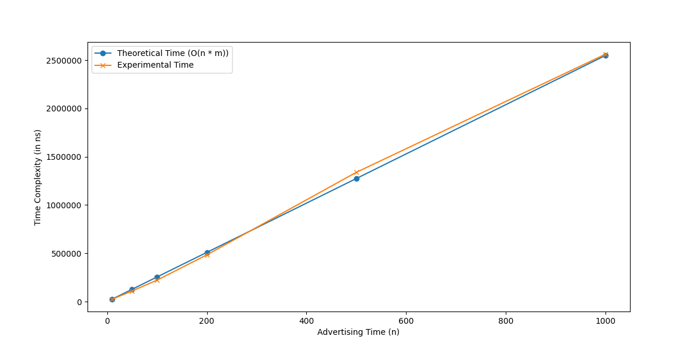

# A profitable TV network

### Problem Statement
The problem is defined as follows:
A TV network has n minutes of advertising time to sell during a prime-time show. The network can sell the time in various slot lengths, with each slot length having a corresponding price that advertisers are willing to pay. Given n (total advertising time), a list of lengths of possible slot lengths, and a list prices of what advertisers pay for each slot, determine the maximum revenue the network can make by selling the n minutes. For example, with n = 10, lengths = [3,5,7] and prices = [8,15,20], the maximum revenue is 30 dollars by selling two 5-minute slots. Use dynamic programming to find the optimal slot combination for maximum revenue
- **Inputs**:
  - `n`: Total advertising time (in minutes).
  - `lengths`: List of possible slot lengths (in minutes).
  - `prices`: List of prices corresponding to each slot length that advertisers are willing to pay.
- **Goal**: Find the combination of slot lengths that maximize the revenue without exceeding the total advertising time.

### Example
Given:
- `n = 10`
- `lengths = [3, 5, 7]`
- `prices = [8, 15, 20]`

The algorithm determines that the maximum revenue is `$30` by selling two `5-minute` slots.

## Approach
This solution uses **dynamic programming** to build an array `dp` where `dp[i]` represents the maximum revenue that can be obtained for `i` minutes of advertising time. The algorithm iterates through each minute from `1` to `n`, checking each available slot length to find the optimal combination. The time complexity of this approach is **O(n * m)**, where `n` is the total advertising time and `m` is the number of slot options.

### Steps:
1. Initialize a `dp` array of size `n + 1`, where `dp[0] = 0` (0 revenue for 0 minutes).
2. For each minute `i` from `1` to `n`:
   - For each slot length in `lengths`, if the slot length is less than or equal to `i`, update `dp[i]` to the maximum revenue achievable for that minute.
3. The final answer will be stored in `dp[n]`.

## Code Implementation

```python
def max_revenue(n, lengths, prices):
    # Initialize dp array where dp[i] is the maximum revenue achievable with i minutes
    dp = [0] * (n + 1)
    
    # Iterate over each time from 1 to n
    for i in range(1, n + 1):
        # Check all slot lengths to determine the maximum revenue for dp[i]
        for j in range(len(lengths)):
            if lengths[j] <= i:
                dp[i] = max(dp[i], dp[i - lengths[j]] + prices[j])

    # The maximum revenue achievable for `n` minutes is in dp[n]
    return dp[n]

### Time Complexity


